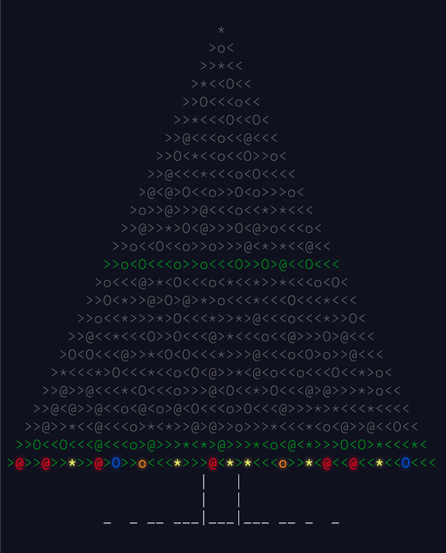

<h1>2015</h1>

 

- Day 1
  - [x] Part 1
  - [x] Part 2
- Day 2 - "Yes, I realize most of these presents are luxury yachts."
  - [x] Part 1
  - [ ] Part 2
- Day 3
  - [ ] Part 1
  - [ ] Part 2
- Day 4 - "Hey, mined your own business!"
  - [ ] Part 1
  - [ ] Part 2
- Day 5 - "John Madden John Madden John Madden"
  - [ ] Part 1
  - [ ] Part 2
- Day 6 - "Hey, be glad I'm not asking for the resistance between two points!"
  - [ ] Part 1
  - [ ] Part 2
- Day 7 -"You had one of these as a kid, right?"
  - [ ] Part 1
  - [ ] Part 2
- Day 8 - "It is common for many programmers to try to escape from string escaping. No such luck here."
  - [ ] Part 1
  - [ ] Part 2
- Day 9 - "Bonus points if you recognize all of the locations."
  - [ ] Part 1
  - [ ] Part 2
- Day 10
  - [ ] Part 1
  - [ ] Part 2
- Day 11
  - [ ] Part 1
  - [ ] Part 2
- Day 12 - "Nor are you likely to be eaten by a grue... during _this_ puzzle, anyway."
  - [x] Part 1
  - [ ] Part 2
- Day 13 - "Finding a method to calculate happiness units is left as an exercise for the reader."
  - [ ] Part 1
  - [ ] Part 2
- Day 14
  - [ ] Part 1
  - [ ] Part 2
- Day 15 - "I know what your preference is, but..."
  - [ ] Part 1
  - [ ] Part 2
- Day 16 - "It can tell them apart by their distinct Dog Residue."
  - [ ] Part 1
  - [ ] Part 2
- Day 17
  - [ ] Part 1
  - [ ] Part 2
- Day 18 - "This is an outrage! We're going to the next town hall meeting."
  - [ ] Part 1
  - [ ] Part 2
- Day 19
  - [ ] Part 1
  - [ ] Part 2
- Day 20 - "This was before the Elves unionized, apparently."
  - [ ] Part 1
  - [ ] Part 2
- Day 21 - "The sky above the battle is the color of television, tuned to a dead channel."
  - [ ] Part 1
  - [ ] Part 2
- Day 22 - "Being a !@#$% Sorcerer."
  - [ ] Part 1
  - [ ] Part 2
- Day 23 - "Definitely not Wintermute."
  - [ ] Part 1
  - [ ] Part 2
- Day 24 - "Santa does not elaborate on what he means by this, but the cringe he makes indicates that it wouldn't be pretty."
  - [ ] Part 1
  - [ ] Part 2
- Day 25 - "The paper is very thin so it can be folded up neatly into the manual."
  - [ ] Part 1
  - [ ] Part 2
