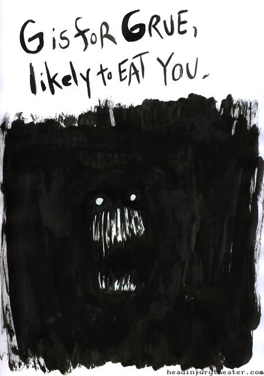

<article class="day-desc">
 <h2>
  --- Day 12: JSAbacusFramework.io ---
 </h2>
 <p>
  Santa's Accounting-Elves need help balancing the books after a recent order.  Unfortunately, their accounting software uses a peculiar storage format.  That's where you come in.
 </p>
 <p>
  They have a
  <a href="http://json.org/">
   JSON
  </a>
  document which contains a variety of things: arrays (
  <code>
   [1,2,3]
  </code>
  ), objects (
  <code>
   {"a":1, "b":2}
  </code>
  ), numbers, and strings.  Your first job is to simply find all of the
  <em>
   numbers
  </em>
  throughout the document and add them together.
 </p>
 <p>
  For example:
 </p>
 <ul>
  <li>
   <code>
    [1,2,3]
   </code>
   and
   <code>
    {"a":2,"b":4}
   </code>
   both have a sum of
   <code>
    6
   </code>
   .
  </li>
  <li>
   <code>
    [[[3]]]
   </code>
   and
   <code>
    {"a":{"b":4},"c":-1}
   </code>
   both have a sum of
   <code>
    3
   </code>
   .
  </li>
  <li>
   <code>
    {"a":[-1,1]}
   </code>
   and
   <code>
    [-1,{"a":1}]
   </code>
   both have a sum of
   <code>
    0
   </code>
   .
  </li>
  <li>
   <code>
    []
   </code>
   and
   <code>
    {}
   </code>
   both have a sum of
   <code>
    0
   </code>
   .
  </li>
 </ul>
 <p>
  You will not
  <span title="Nor are you likely to be eaten by a grue... during *this* puzzle, anyway.">
   encounter
  </span>
  any strings containing numbers.
 </p>
 <p>
  What is the
  <em>
   sum of all numbers
  </em>
  in the document?
 </p>
</article>

<br>
<br>
<br>
<br>
<br>
<br>
<br>
<br>

<div align="center">

<h2>Nothing to see here</h2>

</div>

<br>
<br>
<br>
<br>
<br>
<br>
<br>
<br>
<div align="center">
<h2>Your still here?</h2>
</div>

<br>
<br>
<br>
<br>
<br>
<br>
<br>
<br>
<div align="center">
<h2>DO NOT PASS</h2>
</div>

<br>
<br>
<br>
<br>
<br>
<br>
<br>
<br>
<div align="center">
<h2>Dont say I didnt warn you!</h2>
</div>

<br>
<br>
<br>
<br>
<br>
<br>
<br>
<br>
<br>

<br>
<br>
<br>
<br>
<br>
<br>
<br>
<br>
<br>
<div align="center">
<h2>LAST CHANCE TO SCROLL BACK UP</h2>
</div>
<br>
<br>
<br>
<br>
<br>
<br>
<br>
<br>
<br>

<div align="center">
<details>
<summary>DO NOT ENTER</summary>
<br>

<div align="center">
<h1> I TRIED TO WARN YOU!!!</h1>
<a href="https://knowyourmeme.com/memes/you-are-likely-to-be-eaten-by-a-grue"></img></a>
</div>

[Play Zork](https://classicreload.com/zork-i.html)

<details>
<summary>SPOILERS</summary>
"Nor are you likely to be eaten by a grue... during _this_ puzzle, anyway." - Easter Egg

- There are No [k, m, p, q, s, x, z] in puzzle (except for q none of these letters are controls in the game)

- text based game

- https://zork.fandom.com/wiki/Command_List

</details>
<br>

### Interesting links

- https://codemeta.github.io/
- https://github.com/MITDDC/zork
- [You are likely to be eaten by a grue](https://knowyourmeme.com/memes/you-are-likely-to-be-eaten-by-a-grue)
- https://archivesspace.mit.edu/repositories/2/archival_objects/347748

<details>
<summary>SPOILERS DO NOT PEEK</summary>

```
# looped through each char and creating dict to track its frequency in the string

# Result

        {'{': 340, '"': 6882, 'e': 2013, ':': 1908, '[': 333, '8': 294, '6': 290, ',': 3042, 'c': 260, '2': 347, '3': 324, 'a': 609, '1': 915, '0': 197, '9': 263, 'g': 684, 'r': 754, 'n': 535, 'd': 458, 'o': 804, ']': 333, 'b': 538, '}': 340, 'y': 266, 'l': 1045, 'w': 266, 'f': 187, '-': 306, '4': 352, '7': 248, 'v': 269, 'i': 341, 't': 269, 'h': 113, '5': 254, 'u': 244, 'j': 40}

 Sorted dict result

 # OrderedDict
 ([
     ('"', 6882),
     (',', 3042),
     ('-', 306),
     ('0', 197),
     ('1', 915),
     ('2', 347),
     ('3', 324),
     ('4', 352),
     ('5', 254),
     ('6', 290),
     ('7', 248),
     ('8', 294),
     ('9', 263),
     (':', 1908),
     ('[', 333),
     (']', 333),
     ('a', 609),
     ('b', 538),
     ('c', 260),
     ('d', 458),
     ('e', 2013),
     ('f', 187),
     ('g', 684),
     ('h', 113),
     ('i', 341),
     ('j', 40),
     ('l', 1045),
     ('n', 535),
     ('o', 804),
     ('r', 754),
     ('t', 269),
     ('u', 244),
     ('v', 269),
     ('w', 266),
     ('y', 266),
     ('{', 340),
     ('}', 340)

     ])
```

</details>

<details>
