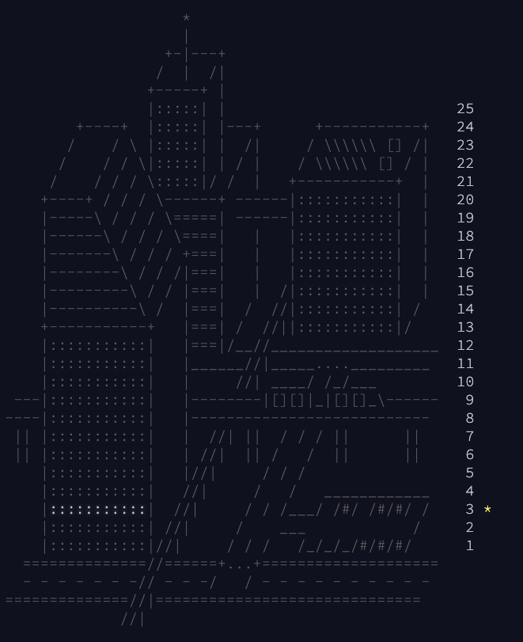

<h1>2016</h1>

 

- Day 1 - "An atomic clock is too inaccurate; he might end up in a wall!"
  - [ ] Part 1
  - [ ] Part 2
- Day 2
  - [ ] Part 1
  - [ ] Part 2
- Day 3 - "Unless it's on a sphere!"
  - [x] Part 1
  - [ ] Part 2
- Day 4
  - [ ] Part 1
  - [ ] Part 2
- Day 5
  - [ ] Part 1
  - [ ] Part 2
- Day 6
  - [ ] Part 1
  - [ ] Part 2
- Day 7 - "Any similarity to the pattern it describes is purely coincidental."
  - [ ] Part 1
  - [ ] Part 2
- Day 8 - "BUT BY WHOM?!"
  - [ ] Part 1
  - [ ] Part 2
- Day 9
  - [ ] Part 1
  - [ ] Part 2
- Day 10
  - [ ] Part 1
  - [ ] Part 2
- Day 11 - "The previous version, model number PB-NUK, used Blutonium."
  - [ ] Part 1
  - [ ] Part 2
- Day 12 - "Strangely, this assembunny code doesn't seem to be very good at multiplying."
  - [ ] Part 1
  - [ ] Part 2
- Day 13 - "You are in a twisty alike of little cubicles, all maze."
  - [ ] Part 1
  - [ ] Part 2
- Day 14 - "This also happens to be the plot of World War II."
  - [ ] Part 1
  - [ ] Part 2
- Day 15 - "These machines are everywhere in Japan, but on a MUCH smaller scale."
  - [ ] Part 1
  - [ ] Part 2
- Day 16 - "If I ever find one of my disks overwritten with a dragon curve, I'll know it was you."
  - [ ] Part 1
  - [ ] Part 2
- Day 17 - "It took four days to rescue the engineer that tried this."
  - [ ] Part 1
  - [ ] Part 2
- Day 18
  - [ ] Part 1
  - [ ] Part 2
- Day 19 - "Eggnoggedly misunderstanding them, actually."
  - [ ] Part 1
  - [ ] Part 2
- Day 20 - "I'll create a GUI interface using Visual Basic... see if I can track an IP address."
  - [ ] Part 1
  - [ ] Part 2
- Day 21 - "I do not like them, Security-Account-Manager-I-Am! I do not like scrambled letters and hash!"
  - [ ] Part 1
  - [ ] Part 2
- Day 22 - "You suspect someone misunderstood the x86 MOV instruction."
  - [ ] Part 1
  - [ ] Part 2
- Day 23
  - [ ] Part 1
  - [ ] Part 2
- Day 24 - "The Brave Little Air Duct Cleaning Robot That Could"
  - [ ] Part 1
  - [ ] Part 2
- Day 25 - "Then again, if something ever works on the first try, you should be _very_ suspicious."
  - [ ] Part 1
  - [ ] Part 2
