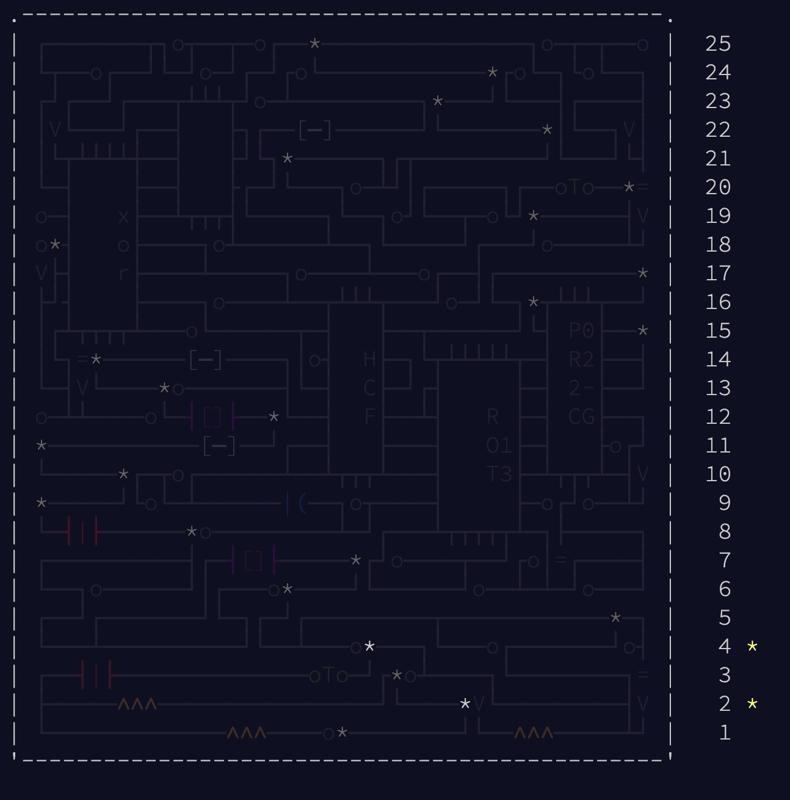

<h1>2017</h1>

 

- Day 1 - "Floor 17: cafeteria, printing department, and experimental organic digitization equipment."
  - [ ] Part 1
  - [ ] Part 2
- Day 2
  - [x] Part 1
  - [ ] Part 2
- Day 3 - "Good thing we have all these infinite two-dimensional grids lying around!"
  - [ ] Part 1
  - [ ] Part 2
- Day 4
  - [x] Part 1
  - [ ] Part 2
- Day 5 - "Later, on its turn, it sends you a sorcery."
  - [ ] Part 1
  - [ ] Part 2
- Day 6 - "There are also five currency banks, two river banks, three airplanes banking, a banked billards shot, and a left bank."
  - [ ] Part 1
  - [ ] Part 2
- Day 7 - "Turtles, all the way down."
  - [ ] Part 1
  - [ ] Part 2
- Day 8 - "There's that sorcery I told you about."
  - [ ] Part 1
  - [ ] Part 2
- Day 9 - "&quot;Don't cross the streams!&quot;, they yell, even though there's only one. They seem to think they're hilarious."
  - [ ] Part 1
  - [ ] Part 2
- Day 10 - "NEW CRYPTOSYSTEM WHO DIS"
  - [ ] Part 1
  - [ ] Part 2
- Day 11 - "Raindrops on roses and whiskers on kittens."
  - [ ] Part 1
  - [ ] Part 2
- Day 12 - "Yes, citizens, plumbing! It's the latest invention to hit Rome!"
  - [ ] Part 1
  - [ ] Part 2
- Day 13
  - [ ] Part 1
  - [ ] Part 2
- Day 14
  - [ ] Part 1
  - [ ] Part 2
- Day 15 - "I guess they _are_ a little banjo-shaped. Why do you ask?"
  - [ ] Part 1
  - [ ] Part 2
- Day 16 - "This is called a 'newline'."
  - [ ] Part 1
  - [ ] Part 2
- Day 17 - "You know, as opposed to all those non-pixelated hurricanes you see on TV."
  - [ ] Part 1
  - [ ] Part 2
- Day 18 - "I don't recommend actually trying this."
  - [ ] Part 1
  - [ ] Part 2
- Day 19 - "I know how fast it's going, but I don't know where it is."
  - [ ] Part 1
  - [ ] Part 2
- Day 20 - "...as if millions of graphics pipelines suddenly cried out for help, but suddenly started working on something else instead because they all have to do the same thing at the same time and can't spend very long asking for help."
  - [ ] Part 1
  - [ ] Part 2
- Day 21 - "This technique is also often used on TV."
  - [ ] Part 1
  - [ ] Part 2
- Day 22 - "The infinite is possible at AdventOfCodeCom."
  - [ ] Part 1
  - [ ] Part 2
- Day 23
  - [ ] Part 1
  - [ ] Part 2
- Day 24
  - [ ] Part 1
  - [ ] Part 2
- Day 25 - "Get it? CPU core?"
  - [ ] Part 1
  - [ ] Part 2
