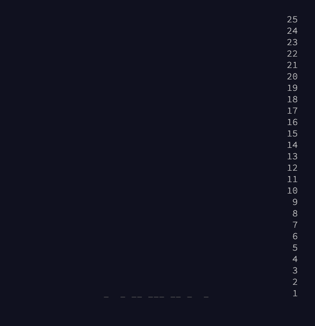

<h1>2018</h1>

 

<h5><a id="spolier2" href="#spoiler2" title="It's about as big on the inside as you expected.">Day 1</h5>
  - [ ] Part 1
  - [ ] Part 2
- Day 2 - "This is, in fact, roughly when chimneys became common in houses."
  - [ ] Part 1
  - [ ] Part 2
- Day 3 - "WAS IT YOU"
  - [ ] Part 1
  - [ ] Part 2
- Day 4 - "Yes, 'sneaked'. 'Snuck' didn't appear in English until the 1800s."
  - [ ] Part 1
  - [ ] Part 2
- Day 5 - "I've always wanted a polymer!"
  - [ ] Part 1
  - [ ] Part 2
- Day 6 - "Why is the situation always critical? Why can't the situation just be boring for once?"
  - [ ] Part 1
  - [ ] Part 2
- Day 7 - "Just some oak and some pine and a handful of Norsemen."
  - [ ] Part 1
  - [ ] Part 2
- Day 8 - "It's North. Obviously."
  - [ ] Part 1
  - [ ] Part 2
- Day 9 - "Do you have any idea how long it takes to load navigation data for all of time and space?!"
  - [ ] Part 1
  - [ ] Part 2
- Day 10 - "At the iceberg, use any lane to turn left. Then, swim for eight thousand miles."
  - [ ] Part 1
  - [ ] Part 2
- Day 11 - "wheeeeeeeeeeeeeeeeee"
  - [ ] Part 1
  - [ ] Part 2
- Day 12 - "It's probably this one. Can never be too sure, though."
  - [ ] Part 1
  - [ ] Part 2
- Day 13 - "Time anomalies! How do they work?!"
  - [ ] Part 1
  - [ ] Part 2
- Day 14 - "Please do not use a programming puzzle as a recipe for hot chocolate. I cannot guarantee your safety."
  - [ ] Part 1
  - [ ] Part 2
- Day 15
  - [ ] Part 1
  - [ ] Part 2
- Day 16
  - [ ] Part 1
  - [ ] Part 2
- Day 17 - "Continuity!"
  - [ ] Part 1
  - [ ] Part 2
- Day 18 - "Trade wood for sheep?"
  - [ ] Part 1
  - [ ] Part 2
- Day 19 - "Good luck maintaining a program that uses a bitwise operation on its instruction pointer, though."
  - [ ] Part 1
  - [ ] Part 2
- Day 20
  - [ ] Part 1
  - [ ] Part 2
- Day 21 - "The old time travel hole gag! Classic."
  - [ ] Part 1
  - [ ] Part 2
- Day 22 - "Yes, really: there is no year zero."
  - [ ] Part 1
  - [ ] Part 2
- Day 23 - "We've always had this button; we've just been too scared to press it."
  - [ ] Part 1
  - [ ] Part 2
- Day 24 - "On second thought, it's pretty similar to regular reindeer immune systems."
  - [ ] Part 1
  - [ ] Part 2
- Day 25 - "It was not an accident."
  - [ ] Part 1
  - [ ] Part 2

<h4><a id="spolier2" href="#spoiler2" title="It's about as big on the inside as you expected.">Dont Peek</a></h4>
